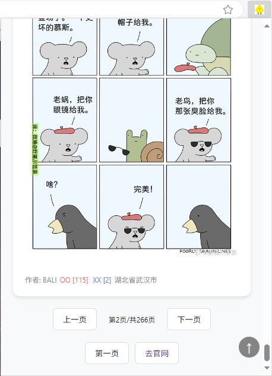

# 煎蛋无聊图谷歌扩展

方便随时看图，自动记录浏览页数，可以点oo或者xx。

# 安装

该插件没有上传商店，关于安装插件，请参考下面这篇文章。

[运行第一个chrome开发插件](https://chrome.lovefc.cn/%E5%88%9D%E6%AD%A5%E4%BA%86%E8%A7%A3/README.html#%E8%BF%90%E8%A1%8C%E7%AC%AC%E4%B8%80%E4%B8%AAchrome%E5%BC%80%E5%8F%91%E6%8F%92%E4%BB%B6)

就是开启开发者模式，加载这个目录，您也可以下载zip包后，把zip改为crx，然后拖进扩展页面，也会提示安装。

## 运行截图

## 后续说明

请勿修改源码后直接用于商业行为，违者将被追究法律责任。
